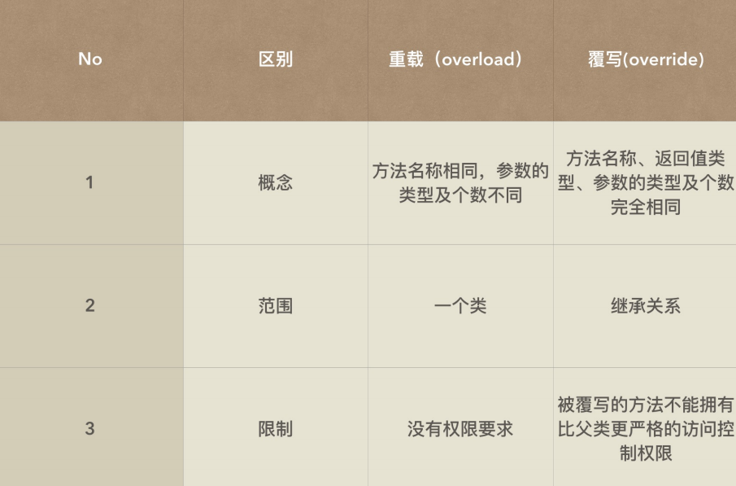

## 覆写

#### 1. 什么是覆写？

**子类定义了和父类相同的方法或者属性时候，这样的操作叫做覆写。**

#### 2. 方法的覆写

>  子类定义了与父类方法名称，参数类型个数完全相同的方法。但是覆写的方法不能有比父类的方法更严格的访问权限。

如：

```java
public class Person {

	public void print()
	{
		System.out.println("Preson的print方法");
	}
}

public class Student extends Person{
    //子类对父类的print方法进行覆写
	@Override
	public void print()
	{
		System.out.println("Student的print");
	}
}

public class TestMain {

	public static void main(String[] args) {
		Student stu = new Student();
		stu.print();
	}

}
```

>  **进行覆写的时候我们需要注意的是子类覆写方法的权限不能够更加严格， 且private < default < public ， 所以当父类的方法是public时，子类覆写的方法只能是public。父类方法是default时， 子类覆写的方法可以是default或者public。**

**那么， 当父类的方法是private， 子类覆写的方法为public时会有什么结果呢？**

父类是private时，该方法对于子类来说并不能直接使用，所以子类定义新的方法属于新的定义和父类没关系。




